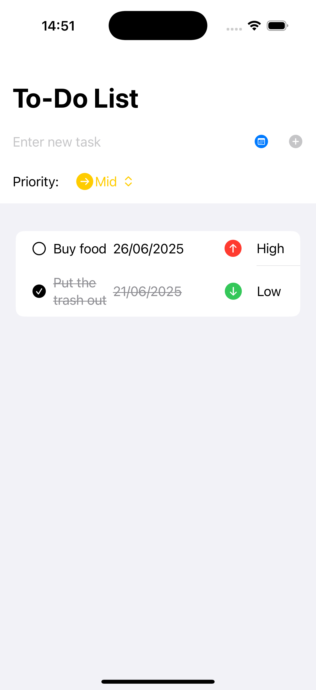

# SimpleToDo

## Description

**SimpleToDo** is a to-do list app developed in SwiftUI using the MVVM pattern. It helps you organize your daily tasks in a simple and efficient way.

## Features

- **Create tasks:** Quickly add new tasks to your list.
- **Delete tasks:** Remove tasks that are no longer needed.
- **Set priorities:** Classify your tasks by priority (low, medium, high) for better organization.
- **Mark as done:** Mark tasks as completed to track your progress.
- **Data persistence:** All information is saved locally, ensuring your tasks are always available even after closing the app.

## Screenshot

Abaixo está um exemplo da tela principal do SimpleToDo em execução no simulador iOS:

## Technologies Used

- **SwiftUI:** Modern, reactive UI framework.
- **MVVM:** Architecture that separates business logic from the UI.
- **Local persistence:** Uses UserDefaults/CoreData (specify according to your project) to save tasks.

## Requirements

- iOS 18 or later

## How to Use

1. Clone this repository.
2. Open the project in Xcode.
3. Run it on a simulator or a real device with iOS 18+.
